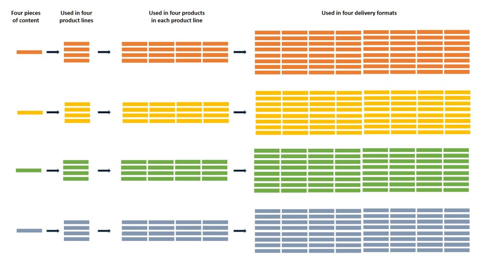
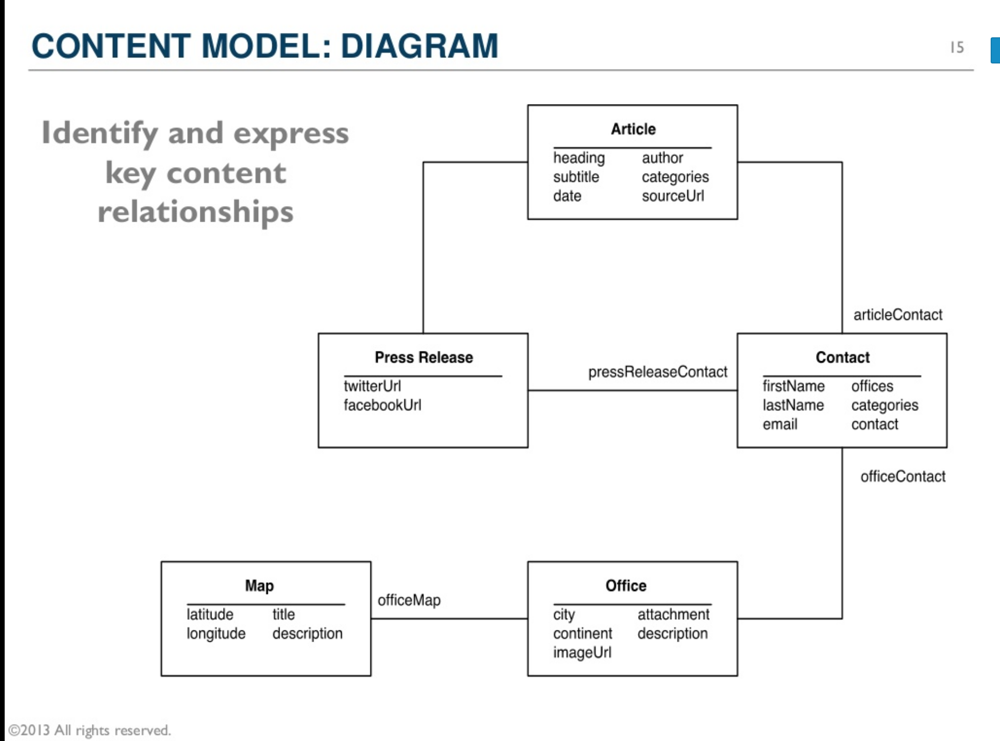

# Zur Definition

---

> Intelligent content is content that is structured to optimize performance with technology. It is structurally rich, semantically categorized, automatically discoverable, reusable, reconfigurable, and adaptable. [@rockley2011]

---

> It means creating building blocks of content (content objects) that have been given meaning, by being tagged and structured so that computers can understand how to process those content objects. This allows content to be re-ordered, re-used, and otherwise manipulated so that you need less content to fulfill more needs, in an extremely agile way. [@bailie2015]

# Wozu intelligent content?

## Digitaler vs. analoger Inhalt

- Leichte Wiederverwendung
- viele Präsentationsformen
- Viele Versionen
- Viele Funktionen
- Durchsuchbarkeit
- Verarbeitbarkeit

---

Bild: [@bailie2015]

---

## Probleme:

- Uneinheitlichkeit
- Redundanz
- Fehlende Aktualität
- Kosten

## Digitale vs. analoge Einheiten

| Analoger Inhalt | Digitaler Inhalt |
| --- |--- |
| Seiten | Textketten und Markup |
| Bücher| Datenaggregate |
|Externe Klassifikation | Metadaten |

---

## Anforderungen an Inhalte

- Kontextunabhängigkeit sichert Verarbeitung: Alle relevanten Informationen müssen mit dem Inhalt verbunden sein
- Standards sichern Kombinierbarkeit: Definierte Formate erlauben Zusammenstellung aus verschiedenen Quellen

---

> It is only with intelligent content \[...\] that it becomes possible to talk about a sustainable enterprise content strategy.[@rockley2011]

---

## Need for Strategy 

- Analyse der Inhalte
- Planung der Verwendungssituationen
- Erfolgskontrolle

---

> An intelligent content strategy establishes a coherent plan under which content will be designed, developed and deployed so as to achieve maximum benefit to the customer and the organization while minimizing the cost to the organization. [@rockley2011]

##

## Automatisierung

> automation doesn't just happen. Content must be consciously designed to support it. [@rockley2011]

---

> If we design and prepare content in a way that is completely portable and open, then a wide range of applications can be used to automate common content tasks such as formatting. [@rockley2011]

# Wie sieht intelligent content aus?

---

> Intelligent content is content that is structurally rich and semantically categorized, and is therefore automatically discoverable, reusable, reconfigurable and adaptable. [@rockley2011]

---

Bild: @hane2017

---

Bild: @hane2017

---

## Structurally rich

> Structure makes it possible to manipulate it. [@rockley2011]

## Semantically categorized

> Semantically categorized content [] is content that has been tagged with metadata to identify the kind of content within it. [@rockley2011]

## Easily discoverable

> Without semantic metadata it is very difficult to automatically, let alone manually, find the content we need.[@rockley2011]

​---

##

> And when it is structurally rich, and assuming our content is in XML, we can use XQuery [], a standard that supports queries of XML data - not just XML files, but anything that can appear as XML, including databases. [@rockley2011]

---

## Content Mining

{ width=70% }

## Reusability

> Reusable content \[...\], content that is created once and used many times, reduces the time to create, manage and publish and reduces translation costs. We can create modular structured content that can either be easily retrieved for manual reuse or automatically retrieved for automated reuse. [@rockley2011]

## Reconfigurability

> Knowing the structure of the content, we can output it to multiple channels reconfiguring it to best meet the needs of the channel, or we can automatically mix and match content to provide us with the information customers need \[...\]. We can even transform content (reconfigure it) from one structure to another  \[...\] [@rockley2011]

## Adaptability

> but content can be adapted (used in a different way), often without our knowledge, to meet a new need. [@rockley2011]

## Metadata

> Unfortunately, applying metadata to a completed document means that it can only adequately describe the content at a very superficial level; it cannot identify the many types of content within the document. [@rockley2011]

## Standardisierung

- Standards sichern Portabilität / Unabhängigkeit von Systemen und Anbietern
- Wichtigste Standards für Intelligent Content: Inhaltsformate (XML), Metadaten

# Voraussetzungen in der Organisation?

## Zentrale Content-Verantwortung

- Festlegung der Strategie
- Definition von Standards
- Durchsetzung der Strategie
- Erfolgskontrolle

## Technischer Support

- Content Management
- Schulung und Weiterbildung
- Benutzerfreundliche Oberflächen

## Keine Silos

- Inhalte sind gemeinsame Assets
- Veränderungen müssen sofort kommuniziert werden

# Strategientwicklung

## The Way: Content Strategy

> An intelligent content strategy establishes a coherent plan under which content will be designed, developed and deployed so as to achieve maximum benefit to the customer and the organization while minimizing the cost to the organization.[@rockley2011]

​--- 

> An effective strategy begins at the design stage, works through the authoring stage, ends at the delivery stage and is continually revisited to ensure it continues to meet the needs of authors, content and customers.[@rockley2011]

​

## The Key: Modeling

> The information modeling process [...] forces you to consider all information requirements [...] In an intelligent content strategy, the information model reflects the semantic structure of your information both at the information product level (for example, brochure) and at the element level (for example, value proposition).[@rockley2011]

---

{ width=70% }

Bild: @rachellovinger2013 

## Reuse Strategy
​

> A reuse strategy identifies what types of content will be reused, the level of granularity, how the content will be reused and how to support authors in easily and effectively reusing it. Your strategy will depend upon your goals, your content, your authors and your selected technology.[@rockley2011]

## Taxonomy Strategy

> The taxonomy strategy enables you to intelligently store and retrieve your content based on a common vocabulary and shared metadata. [@rockley2011]

---

> In addition to traditional metadata for information storage and retrieval, it is important to develop metadata to define the delivery channel (print, web, wireless), the method of filtering the content (product, customer segment/audience, region, product version) and the final information product (brochure, web, eBook).[@rockley2011]

## Workflows

## 

> An intelligent content strategy also involves people and intelligent (collaborative) processes. Collaboration ensures that the content elements are consistent and can be reused wherever they're required. Processes should be redesigned to match the intelligent content strategy and support the way the authors work. [@rockley2011]

---

> With DITA - an XML-based, end-to-end architecture for authoring, producing and delivering technical information - we could create structured, modular, reusable content [...] that could be automatically adapted to each of the desired outputs (print, web, mobile). It also provided a strong support for translation.[@rockley2011]

# XML und Content Management

## 

<iframe width="1280" height="720" src="https://www.youtube.com/embed/2as6vcGiRa0" frameborder="0" allowfullscreen></iframe>

[ICC 2016 - Ensuring Technology Meets your Intelligent Content Needs - Ann Rockley - YouTube](https://www.youtube.com/watch?time_continue=1&v=2as6vcGiRa0)

## XML

> While you don't have to use XML for your content, XML really helps make your content intelligent. Traditional office documents are simply files, and you have no access to the content because content is unstructured.[@rockley2011]

## XML und Content Delivery

> When it comes to delivering content, XML gives us a very wide range of options. In fact, part of the rationale for XML was to liberate content owners from being limited to providing only one or two delivery formats [@rockley2011]

## DITA: Maps

~~~ { .xml }
<?xml version="1.0" encoding="UTF-8"?>
<!DOCTYPE map
  PUBLIC "-//OASIS//DTD DITA Map//EN" "map.dtd">
<map>
  <title>The Project Gutenberg eBook of <ph
      outputclass="cite">The Mysterious Island</ph>, by Jules Verne</title>
  <topichead
    navtitle="License Statement">
    <topicref
      href="legalstuff/main-page.xml"/>
  </topichead>
  <topicref
    navtitle="The Mysterious Island"
    href="parts/title-page.xml"
    collection-type="sequence"/>
  <topicref
    href="parts/part-01.ditamap"
    format="ditamap"/>
  <topicref
    href="parts/part-02.ditamap"
    format="ditamap"/>
  <topicref
    href="parts/part-03.ditamap"
    format="ditamap"/>
  <topichead
    navtitle="end-of-book">
    <topicref
      href="legalstuff/end-of-book.xml"/>
  </topichead>
</map>
~~~

## XQuery

~~~ { .xml }

declare variable $firstName as xs:string external;
<videos featuring="{$firstName}">
{
let $doc := .
for $v in $doc//video,
$a in $doc//actors/actor
where ends-with($a, $firstName)
and $v/actorRef = $a/@id
order by $v/year
return
<video year="{$v/year}">
{$v/title}
</video>
}
< /videos>

~~~

Quelle: @kay

---
~~~ { .xml }

<videos featuring="Lisa">
<video year="1999">
<title>Enemy of the State</title>
</video>
<video year="1999">
<title>Clerks</title>
</video>
</videos>

~~~
Quelle: @kay

## DocBook

> DocBook does not support reuse as effectively as DITA, but it does provide a simpler conversion path from traditional business documents to XML.[@rockley2011]

Beispiel: [docbook.org/docs/howto/howto.xml](http://docbook.org/docs/howto/howto.xml "docbook.org/docs/howto/howto.xml")

## Component CMS

> Intelligent content needs an XML-aware system like a component content management system (CCMS) []. CCMS manage content at a granular (component) level of content, rather than at the page or document level.[@rockley2011]

- [Component Content Management: What Is It and Why Does It Matter? - The Content Wrangler](http://thecontentwrangler.com/2008/02/04/component_content_management_what_is_it_and_why_does_it_matter/ "Component Content Management: What Is It and Why Does It Matter? - The Content Wrangler")

# Information 4.0

## Industrie 4.0

Bild: @gollner2016

## Content Molecules

Bild: @gollner2016

# Ressourcen

## Events

[ContentTECH Summit](https://www.contenttechsummit.com/) (former Intelligent Content Conference)

[Adobe DITA World 2018 – Home - Adobe DITA World 2018 – The DITA Online Conference](https://2018-adobe-dita-world.meetus.adobeevents.com/)

[2019 Programme | Omnichannel Conference](https://omnichannelx.digital/programme_2019/)

## Präsentation und Literatur

Repository: [heinzwittenbrink/slides-intelligentcontent: Slides for presentations on intelligent content](https://github.com/heinzwittenbrink/slides-intelligentcontent "heinzwittenbrink/slides-intelligentcontent: Slides for presentations on intelligent content")

Literatur: [https://heinzwittenbrink.github.io/slides-intelligentcontent/ic.html#refs](https://heinzwittenbrink.github.io/slides-intelligentcontent/ic.html#refs)

## Quellen
